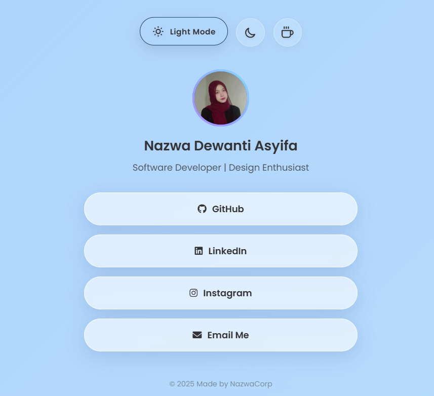
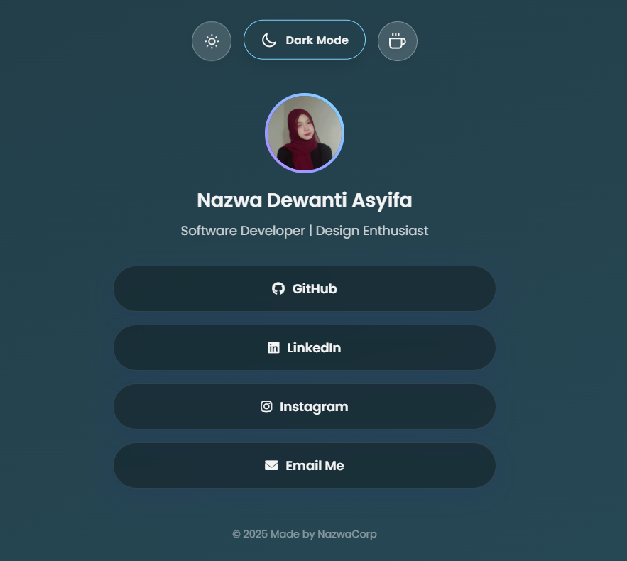
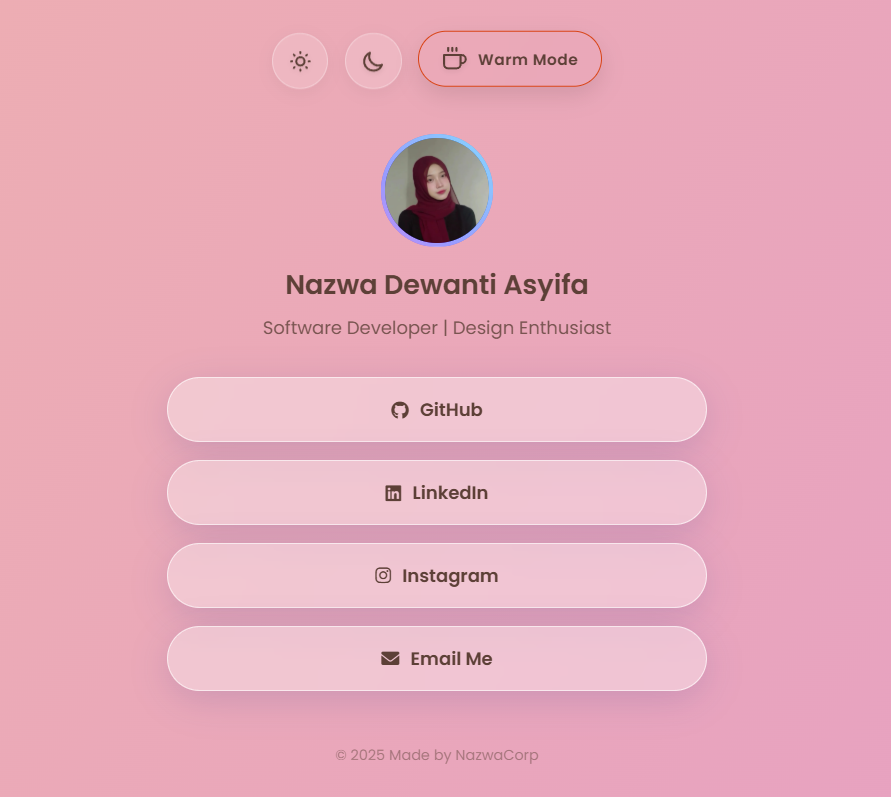

# ✨ My Personal Linktree Clone

A fully responsive, customizable personal link management page featuring a modern **Glassmorphism UI**, smooth animations, and **Multi-Theme support** (Light, Dark, and Warm modes).

Built to showcase proficiency in Semantic HTML, CSS Layouts, and DOM Manipulation.

<h2 align="center">📸 Preview Themes</h2>

  
  &nbsp; &nbsp; 
  &nbsp; &nbsp; 
  

  Light Mode &nbsp;&nbsp;&nbsp;&nbsp;&nbsp;&nbsp;&nbsp;&nbsp;&nbsp;&nbsp;&nbsp;&nbsp; 
  Dark Mode &nbsp;&nbsp;&nbsp;&nbsp;&nbsp;&nbsp;&nbsp;&nbsp;&nbsp;&nbsp;&nbsp;&nbsp;&nbsp; 
  Warm Mode

## 🚀 Features

- **🎨 Multi-Theme Support:** - ☀️ **Light Mode:** Fresh & Clean gradient.
  - 🌙 **Dark Mode:** Elegant "Midnight Space" gradient.
  - ☕ **Warm Mode:** Cozy "Sunset Peach" gradient.
- **💎 Glassmorphism Design:** Modern frosted glass effect using `backdrop-filter`.
- **✨ Micro-Interactions:** - Smooth entrance animations (Staggered Fade-in).
  - "Shine" effect on button hover.
  - Floating pill-shaped theme switchers.
- **📱 Fully Responsive:** Looks great on Mobile, Tablet, and Desktop.
- **⚡ Lightweight:** Built with pure Vanilla JS (No libraries/frameworks).

## 🛠️ Tech Stack

- **HTML5:** Semantic structure.
- **CSS3:** Flexbox, CSS Variables (`:root`), Keyframe Animations, Media Queries.
- **JavaScript:** DOM Manipulation for theme switching logic.

## 💡 Key Learnings

Building this project helped me understand:
1.  **CSS Variables:** How to manage complex color themes efficiently without rewriting code.
2.  **DOM Manipulation:** Switching classes on the `<body>` tag to trigger theme changes.
3.  **Advanced CSS:** Using `backdrop-filter`, linear gradients, and complex transitions.
4.  **Accessibility:** Using semantic tags and ARIA labels for buttons.
